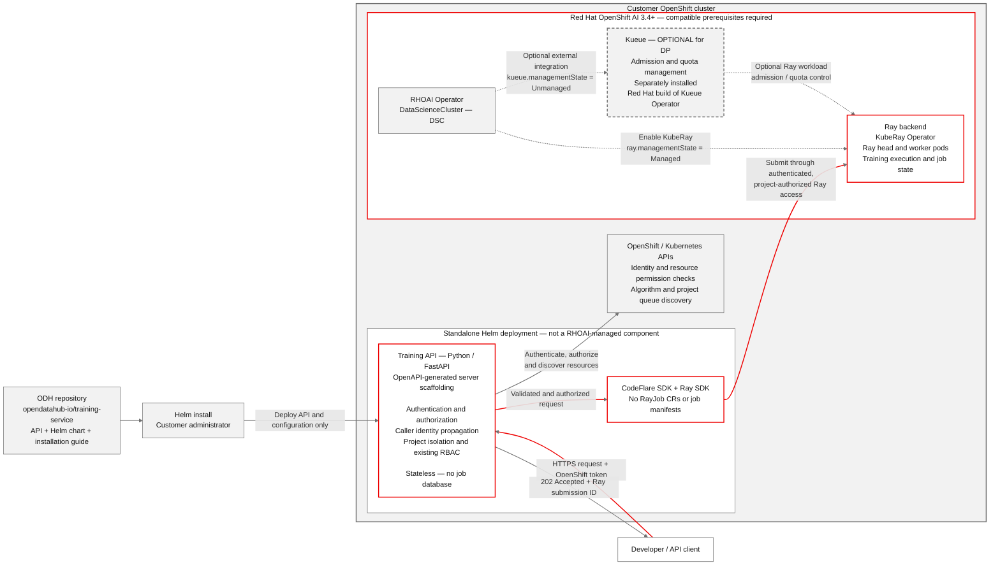

# Training API — Developer Preview

The Developer Preview (DP) is the minimum implementation needed for customer evaluation of the Training API.

The service and its Helm chart live in one ODH repository: [opendatahub-io/training-service](https://github.com/opendatahub-io/training-service). This document describes the proposed DP implementation, not functionality already implemented by the service scaffold.

## Installation and compatibility

Customers install the Training API using Helm. It is not an operator and does not require a new DataScienceCluster component.

Delivery is planned in the RHOAI 3.6 GA timeframe, but the preview is distributed separately and is not bundled with that release. The compatibility target is RHOAI 3.4 and later, subject to supported dependency and platform requirements. This is a target, not a claim that all combinations have been tested.

The customer environment must provide:

- A supported Ray backend and compatible CodeFlare and Ray SDK versions.
- An authenticated Ray access path that allows the API to enforce the caller's existing OpenShift permissions in the target project.
- Supported training algorithms/images, compute resources, and access to the required model, dataset, and output storage.
- Kueue only when queue-based admission is used; the API must respect the configured admission policy.

RHOAI 3.4's documented distributed-workload setup includes Kueue. Kueue is optional in this DP design only where the selected CodeFlare/Ray configuration supports a non-queued path; existing cluster admission policies must still be enforced. When enabled, use the externally installed Kueue Operator with DSC integration set to `Unmanaged`, not embedded `Managed` Kueue.

The Helm chart deploys the Training API and its supporting configuration. It does not install a new Training API operator or replace the customer's Ray platform. Supported dependency versions and installation steps will be documented in the repository.

## How it works

1. The customer installs the Helm chart and configures access to the supported Ray environment.
2. A caller submits an algorithm, model, dataset, and job name to the API, with optional resource and training settings.
3. The API authenticates the caller, checks project/resource permissions, and validates the request.
4. The API uses the CodeFlare and Ray SDKs to submit the training job and returns a `202` receipt with the Ray submission ID. Ray runs the training and retains job state.

The API does not construct or manage `RayJob` custom resources or Ray job manifests. It has no job database; subsequent job requests use Ray's state. Algorithm and queue discovery use Kubernetes APIs directly.

## API scope

The contract stays focused on submitting training jobs and the supporting operations already agreed. The job list, detail, log, and terminal-record deletion endpoints remain available; they are not removed with the separate cancel/pause/resume operations.

Paths below are relative to `/api/v1` and describe the proposed DP contract. The existing [OpenAPI scaffold](../api/openapi.yaml) has a broader scope; aligning it and regenerating the server is a separate change, not part of this architecture-only proposal.

| Operation | Endpoint |
| --- | --- |
| Submit training | `POST /projects/{project}/training-jobs` |
| List jobs | `GET /projects/{project}/training-jobs` |
| Get job details/status | `GET /projects/{project}/training-jobs/{job_id}` |
| Read/follow driver logs | `GET /projects/{project}/training-jobs/{job_id}/logs` |
| Delete a terminal job record | `DELETE /projects/{project}/training-jobs/{job_id}` |
| Discover algorithms | `GET /algorithms` |
| Discover project queues | `GET /projects/{project}/queues` |
| Estimate resources — stretch goal | `POST /training-jobs/estimate` |

Cancel, pause, and resume are out of scope. DELETE removes only a terminal Ray job record: it does not stop a running job or delete Kubernetes resources, checkpoints, or model outputs. Logs are driver logs; training metrics/progress are optional when available.

Estimation is a stretch goal, not a DP requirement. It calculates from supplied inputs without submitting a job or accessing private resources.

## Security model

The preview must demonstrate:

- **Authentication:** validate the caller's OpenShift token.
- **Authorization and RBAC:** check the caller's existing permissions before accessing project resources or performing Ray job operations.
- **Caller identity propagation:** carry the verified caller identity through supported downstream authentication and authorization mechanisms.
- **Project isolation:** scope jobs, queues, Secrets, PVCs, and logs to the authorized target project.
- **No privilege elevation:** never fall back to a shared privileged identity or grant callers additional OpenShift permissions.

Forwarding a token to Ray is not sufficient by itself. The supported Ray access mechanism and its mapping to OpenShift permissions must be confirmed before customer use. If that access cannot be authorized, the API must deny the operation.

The service remains stateless: no durable job database and no stored caller tokens or credentials.

## Implementation and delivery

- Use Python/FastAPI, generating the server-side scaffolding and models from the OpenAPI specification.
- Keep the API, Helm chart, and user documentation in the single `training-service` repository.
- Provide Markdown installation and usage guides, including prerequisites and supported dependency versions.
- Keep automated testing to minimal unit tests. No Helm tests or broad integration/end-to-end suite for this preview.
- Do not add a Kubeflow backend, an operator, or cancel/pause/resume behavior to this DP.

## References

- [RHOAI 3.4 distributed-workload installation](https://docs.redhat.com/en/documentation/red_hat_openshift_ai_self-managed/3.4/html/installing_and_uninstalling_openshift_ai_self-managed/installing-the-distributed-workloads-components_install)
- [RHOAI Kueue integration and management states](https://docs.redhat.com/en/documentation/red_hat_openshift_ai_self-managed/3.4/html/managing_openshift_ai/managing-workloads-with-kueue)
